# Queue 시스템 문서

MongoDB 기반의 뉴스 기사 큐 시스템입니다. 크롤링된 기사를 Discord에 발행하기 전에 버퍼링하고 관리합니다.

## 목차
- [전체 아키텍처](#전체-아키텍처-다이어그램)
- [큐 아이템 상태](#큐-아이템-상태-다이어그램)
- [주요 메서드 흐름](#주요-메서드-흐름도)
- [클래스 구조](#클래스-관계-다이어그램)
- [데이터 흐름](#데이터-흐름-시퀀스-다이어그램)

## 전체 아키텍처 다이어그램

```mermaid
graph TB
    subgraph "데이터 소스"
        A[MongoDB Articles Collection]
    end
    
    subgraph "Queue 시스템"
        B[QueueInterface<br/>추상 인터페이스]
        C[MongoDBQueue<br/>구현체]
        D[QueueService<br/>비즈니스 로직]
        E[MongoDB Queue Collection]
    end
    
    subgraph "발행 시스템"
        F[Discord Publisher Service]
        G[Published Articles Storage]
    end
    
    A -->|기사 조회| D
    B -.->|구현| C
    D -->|사용| C
    C <-->|CRUD| E
    D -->|큐 아이템 제공| F
    F -->|발행 완료| G
    F -->|상태 업데이트| D
```

## 큐 아이템 상태 다이어그램

## 주요 메서드 흐름도

## 클래스 관계 다이어그램

## 데이터 흐름 시퀀스 다이어그램

## 주요 기능

### 1. 중복 방지
- `unique_id`를 통한 중복 체크
- MongoDB unique index로 보장

### 2. 동시성 처리
- `find_one_and_update()`를 사용한 atomic operation
- Race condition 방지

### 3. 재시도 로직
- 실패한 아이템의 `retry_count` 관리
- 최대 재시도 횟수 제한

### 4. 상태 관리
- PENDING → PROCESSING → COMPLETED/FAILED
- 각 상태별 타임스탬프 기록
